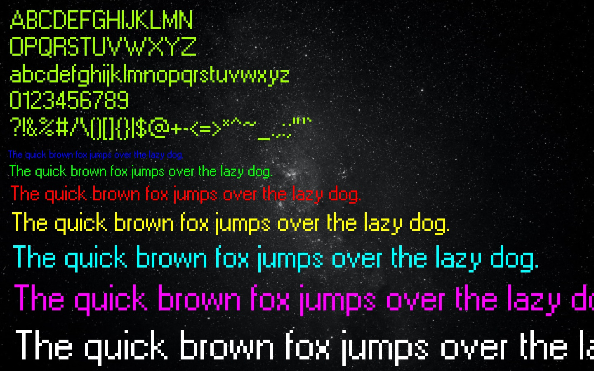
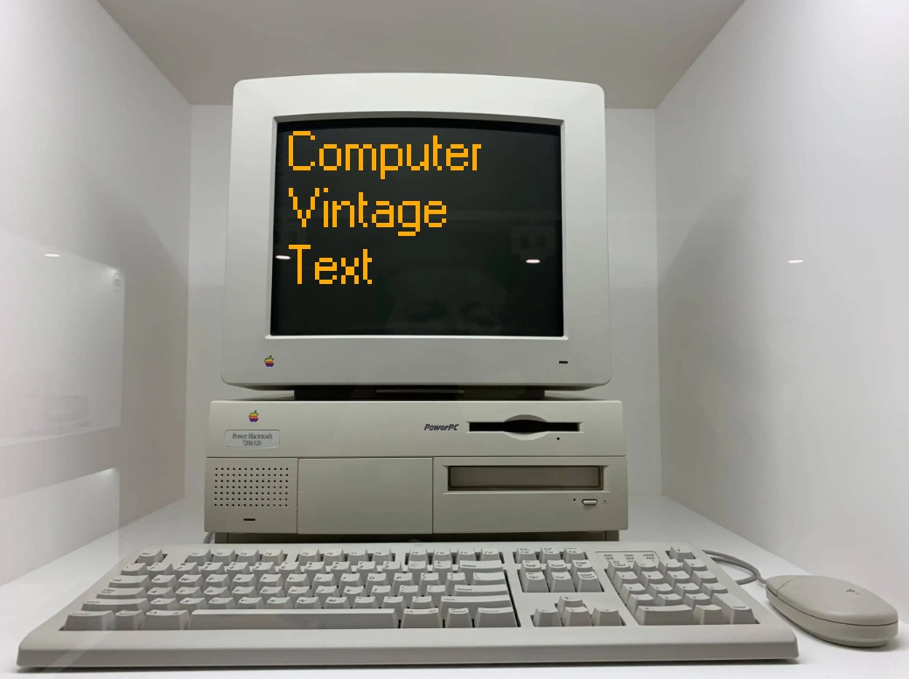

# Computer Vintage Text

**As the name suggests, this Python app enables you to insert computer vintage text to your image.**

The image itself can be a flat background or any of them in the input. There can be one or multiple texts that can be in any color (RGB), in any font size and can be positioned to anywhere on the image!

In the 1st version, there is **one** type of font supported, which is seen in **Microsoft Windows** operating system across many versions (95/98/ME/NT 4.0/2000/XP).





## Usage

The main script is `computer_vintage_text_main.py`. You have to start with the `mode` paramater where you need to enter either `1` or `2`. Then, enter the additional parameters that are specific to the selected mode:

```
python computer_vintage_text_main.py 1 <width> <height> <bg_red> <bg_green> <bg_blue>
python computer_vintage_text_main.py 2 <image_file_name>
```

### Mode 1

The first mode is for selecting a fully flat background with the defined resolution (`width` by `height`) and color (in `RGB` format). So, there are 5 additional parameters and they all must be integers.

Note that the minimum of **200x200** and the maximum of **1920x1080** resolution is supported and every color degree must take value between **0 and 255**.

### Mode 2

The second mode is for selecting a background image from the `Input` folder, thus the only additional parameter is the image name. Just make sure the image is placed into the `Image` folder.

### Inserting Text

In order to insert text to the image, you need to use the file `text_to_insert.txt`. In other words, all texts which will be inserted to the selected image are defined in this file. There are some special rules you need to obey to not encounter any problems:

- First, enter the text you want to insert. You can add `\n` if you want to start a new line.

- After text, you must start the next line with `>` to indicate the parameters that are specific to the text with this exact order:
```
> <red_value> <green_value> <blue_value> <x_pos> <y_pos> <font_size> <draw_bg>
```
- Here, `<red_value>`, `<green_value>` and `<blue_value>` relate to the color of the text in RGB format.
- `<x_pos>` and `<y_pos>` indicate the top left position of the text.
- `<font_size>` is the magnitude of the vintage text in pixels.
- `<draw_bg>` determines whether the text should have its own background that is compatible to the selected color. Must be either `0` or `1`.

- Then, you must enter four dashes `----` to indicate the end of the text insertion or if you want to insert another text, so you need to repeat the steps above.

- Any text that is started with `#` are considered to be line comment. This allows you to keep the texts and their parameters for later use.

It is highly advised to take a look at the file for text insertion for how it can be used properly.

### Preview & Save Image

When the texts are ready, execute the file `computer_vintage_text_main.py` with the appropriate mode and parameters to preview the image.

Press `ESC` to quit and edit the texts for your like.

Press `S` to save the image if you are satisfied with the settings. The saved image can be found in `Output` folder.

Note that currently `.jpg` and `.png` files are accepted but any images are saved as `.jpg` file, plus they contain `_out` suffix in their file names.
